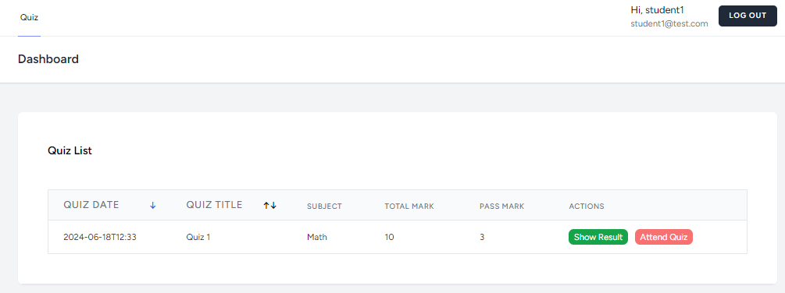
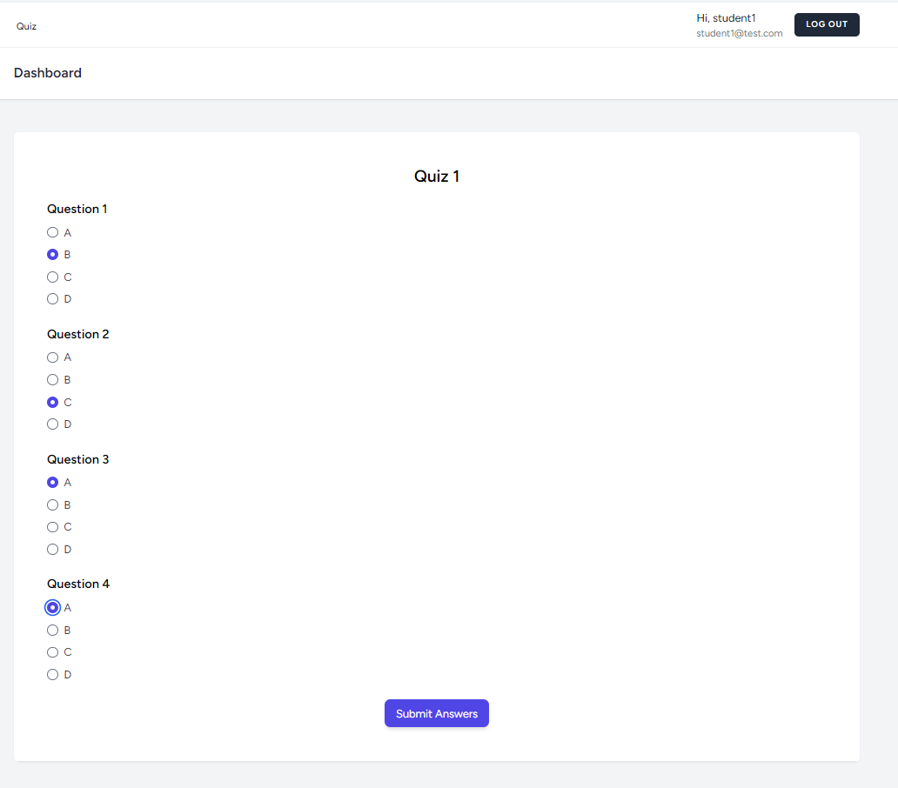

## About Quiz Score

It is a Laravel 11 Vue 3 Vite based demo project reflecting the way of authentication using laravel sanctum and use Vue 3 as frontend framework. Build with love and open source for developers.
In this project, there are two profiles one is admin profile and another one is student profile. admin can create quiz and related questions for students. And student can attend quiz, get marks. It includes user authentication, subject-wise quiz attendance, scoring with negative marking, and ranking of users based on their quiz performance.

# Requirements:

-   User Authentication Module: Implement a secure user authentication system to manage user login and registration.
-   Quiz Management: Develop functionalities for creating, managing, and attending quizzes, categorized by subjects.
-   Question Bank: Create a database of questions, with provisions for scoring and negative marking for incorrect answers.
-   Result Calculation and Ranking System: Implement a system to calculate quiz results and rank users based on their performance.
-   Database Schema: Schemas for users, quizzes, questions, and results.
-   API Endpoints: API endpoints created to support the functionalities of the system.
-   Tech Stack:

1. Laravel
2. Vue JS
3. Composition API - Vue JS
4. Tailwind CSS
5. Vite
6. SQLite/MySQL -- (set via .env)
7. PHP ^8.2 (must be installed)

## Getting Started Step by Step setup

1. In your root folder, clone the project repository using
   `git clone https://github.com/rafi021/quiz-score.git`
2. Open ternimal (bash/cmd). Then go to the project folder using command
   `cd quiz-score`

3. Then install required libraries using (PHP 8.2 required)
   `composer install`

4. Then create a .env file and generate key for this project using command
   `cp .env.example .env`

`php artisan key:generate`

5. Setup MYSQL from .env and use Sqlite (already stored in database folder named -- database.sqlite)
   -- to use sqlite you must enable `pdo_sqlite` from php.ini
   create a database file named database.sqlite in the database folder
   for sqlite

```
database
    |-- database.sqlite
```

for MySQL uncomment this lines

```
DB_HOST=127.0.0.1
DB_PORT=3306
DB_DATABASE=quiz_score
DB_USERNAME=root
DB_PASSWORD=
```

6. After connecting the db with project, then run command
   If you use sqlite, then you don't need to run command

```
php artisan migrate:fresh --seed
```

7. Running migrate and db-seed gives you 1 admin account to manage quiz and question and 2 student account to attend quiz

```
admin credentials
email: admin@test.com
pass:  1234
```

```
studen1 credentials
email: student1@test.com
pass:  1234
```

```
student2 credentials
email: student2@test.com
pass:  1234
```

7. Then compile all CSS & JS files together using this command

```
npm install && npm run dev
```

8. Then open another terminal and run this command

```
php artisan serve
```

Now you can login with admin credentials to manage quiz and questions and student credentials to attend quiz and get results.

9. (Optional) Now you can login with admin credentials and add quiz first and then add questions to that quiz --see project images folder for steps


10. (Optional) Now you can login with student credentials and attend quiz






If you found any problem, please feel free to reach me.
